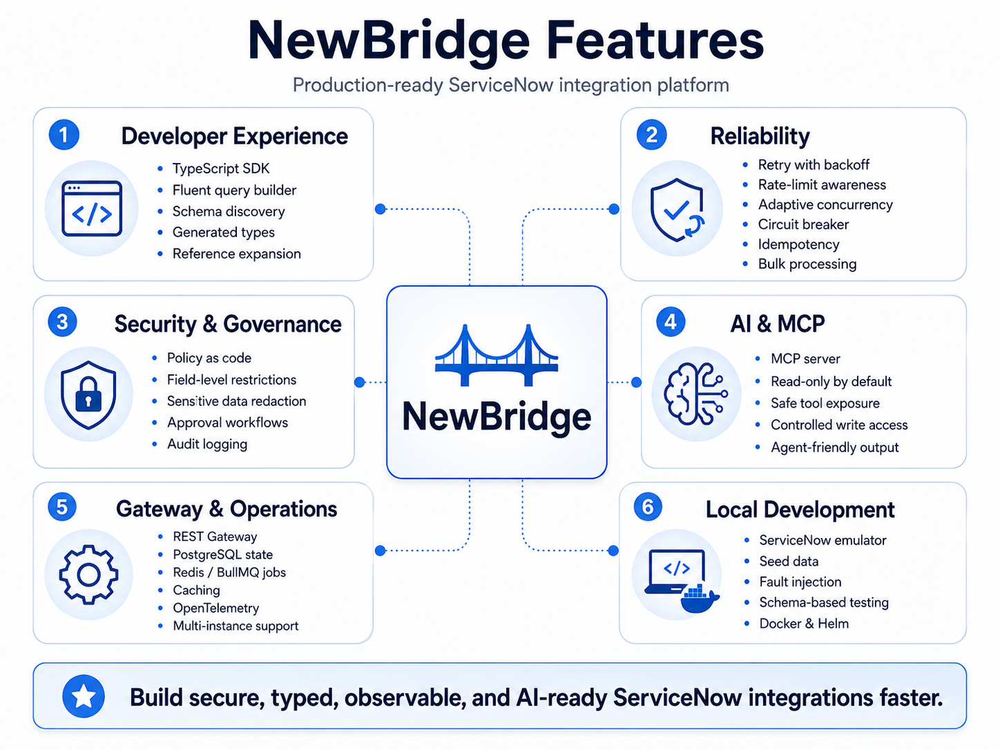
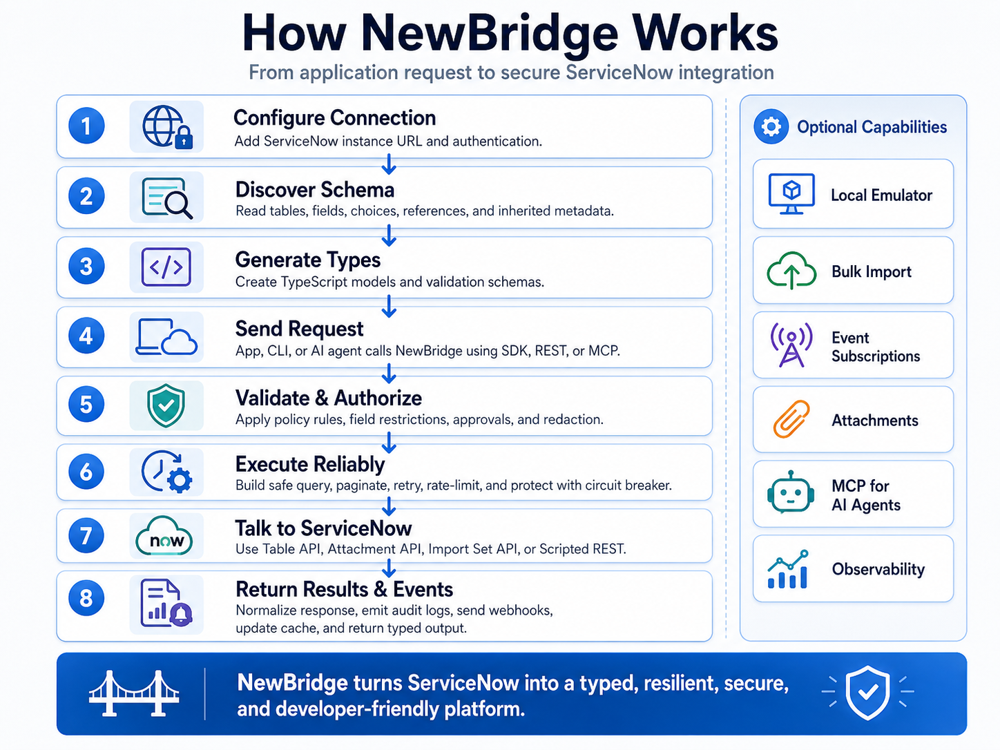
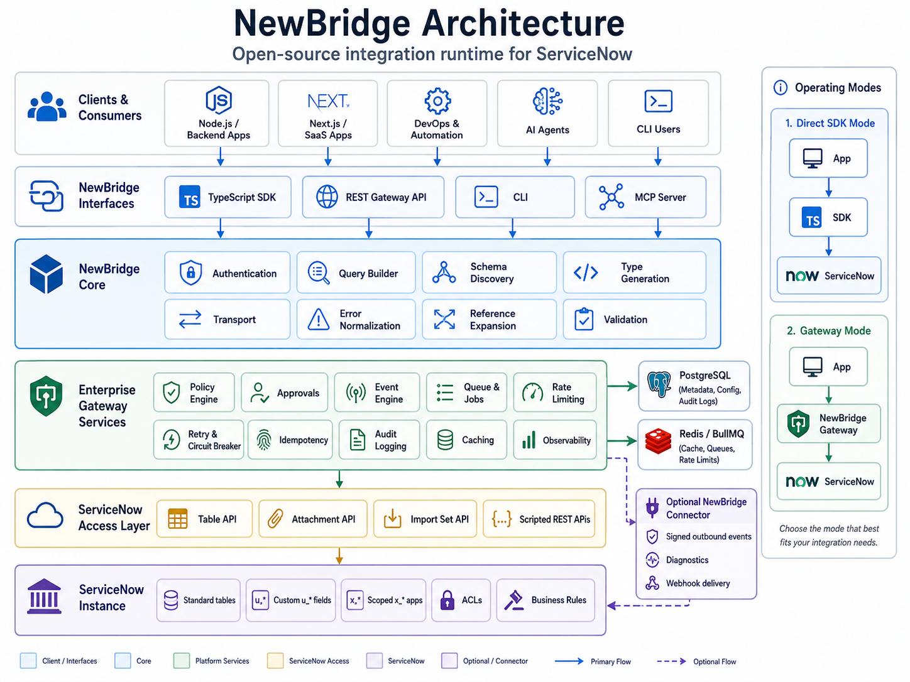

# NewBridge

**The open-source integration runtime for ServiceNow.**

NewBridge gives application developers a typed, resilient and policy-aware way to integrate with ServiceNow. It combines a TypeScript SDK, dynamic schema discovery, safe query construction, local emulation, event polling, an enterprise gateway, MCP tools, audit controls and production deployment assets in one monorepo.

> NewBridge is an independent open-source project. It is not an official ServiceNow product and is not affiliated with or endorsed by ServiceNow.

## Why NewBridge

A normal ServiceNow integration quickly grows beyond CRUD. Teams repeatedly rebuild OAuth handling, encoded queries, pagination, retries, rate-limit handling, schema types, queues, observability, audit trails, local mocks and AI safety controls. NewBridge centralizes those concerns while keeping ServiceNow ACLs authoritative.



## How It Works



## Packages

| Package | Purpose |
| --- | --- |
| `@newbridge/core` | auth, transport, errors, timeouts |
| `@newbridge/query` | safe encoded-query builder |
| `@newbridge/resilience` | retry, adaptive concurrency, circuit breaker |
| `@newbridge/schema` | schema discovery, type generation, diffs |
| `@newbridge/sdk` | high-level ServiceNow SDK |
| `@newbridge/events` | durable-friendly polling/watch abstraction |
| `@newbridge/policy` | policy-as-code, approvals, redaction |
| `@newbridge/telemetry` | OpenTelemetry helpers, JSON logs, metrics |
| `@newbridge/gateway` | Fastify gateway, Postgres state, Redis/BullMQ jobs |
| `@newbridge/emulator` | local ServiceNow-compatible integration emulator |
| `@newbridge/mcp` | MCP tools backed by SDK and policy |
| `@newbridge/cli` | `newbridge` command line interface |

## Five-minute SDK example

```bash
npm install @newbridge/sdk
```

```ts
import { NewBridge } from '@newbridge/sdk';

const sn = new NewBridge({
  instance: process.env.SERVICENOW_INSTANCE!,
  auth: {
    type: 'oauth-client-credentials',
    clientId: process.env.SERVICENOW_CLIENT_ID!,
    clientSecret: process.env.SERVICENOW_CLIENT_SECRET!
  },
  resilience: {
    retries: 3,
    concurrency: 10,
    circuitBreaker: true
  }
});

const incidents = await sn
  .table('incident')
  .where('active', true)
  .whereIn('priority', ['1', '2'])
  .select(['sys_id', 'number', 'short_description', 'priority'])
  .orderByDesc('sys_created_on')
  .limit(50)
  .find();
```

NewBridge deliberately rejects reserved encoded-query characters when they appear in structured filter values and cannot be represented safely. If an exact match requires a ServiceNow encoded-query structural character, use an alternative field or a carefully reviewed raw-query escape hatch. Gateway raw queries are disabled by default.

Custom tables work the same way:

```ts
await sn.table('u_customer_asset').where('active', true).find();
await sn.table('x_company_project').where('state', '2').find();
```

## Schema generation

```bash
newbridge schema pull --connection dev
newbridge generate
```

This reads accessible `sys_db_object`, `sys_dictionary` and `sys_choice` metadata and emits TypeScript interfaces for the real instance.

## Streaming

```ts
for await (const incident of sn.table('incident').where('active', true).stream({ pageSize: 500 })) {
  console.log(incident.number);
}
```

## Attachments

```ts
await sn.attachments.upload({
  table: 'incident',
  sysId: incidentId,
  fileName: 'diagnostics.txt',
  contentType: 'text/plain',
  data: new TextEncoder().encode('diagnostic data')
});
```

## Import Sets

```ts
await sn.importSets.insert('u_import_asset', {
  u_name: 'router-01',
  u_serial: 'ABC123'
});
```

## Events

```ts
import { EventClient } from '@newbridge/events';

const watcher = new EventClient(sn).watch({
  connection: 'prod',
  table: 'incident',
  intervalMs: 10_000
});

watcher.on('event', event => console.log(event));
await watcher.start();
```

The polling adapter uses a persisted-cursor interface and emits at-least-once style change events. Production applications should use a durable cursor store and idempotent consumers.

## Local emulator

```bash
newbridge emulator start --seed ./fixtures.json
```

Then set:

```env
SERVICENOW_INSTANCE=http://127.0.0.1:8181
SERVICENOW_TOKEN=development
```

The emulator supports Table CRUD, query filtering, pagination, attachments, Import Set contracts, validation hooks and failure injection.

## Gateway

```bash
docker compose up --build
```

The Gateway provides:

- centralized ServiceNow connections
- API-key authentication
- policy checks
- field restrictions
- approval records
- idempotency
- Postgres audit/state
- Redis/BullMQ jobs
- health/readiness
- OpenTelemetry hooks
- structured logs

Example request:

```bash
curl -H "Authorization: Bearer $NEWBRIDGE_GATEWAY_API_KEY" \
  "http://localhost:8080/v1/connections/dev/tables/incident/records?limit=20"
```

## MCP

`@newbridge/mcp` exposes ServiceNow tools using the same SDK and policy engine. The default model is read-only. Write tools are only registered when `allowWrite` is explicitly enabled, and policy rules still apply.

See `examples/mcp/server.ts`.

## Security model

NewBridge does not bypass ServiceNow authorization. ServiceNow ACLs and roles remain authoritative. Gateway/MCP policies can make access more restrictive, never more permissive than the upstream integration identity.

Production defaults and guidance include:

- HTTPS for non-local ServiceNow URLs
- finite request timeouts
- Basic Auth compatibility only, with OAuth preferred
- no secrets in structured logs
- deny-by-default MCP writes
- API output limits
- safe structured queries for MCP
- no `javascript:` encoded queries in CLI/Gateway raw query paths
- non-root container runtime
- GitHub dependency, secret and container scanning

Read [SECURITY.md](SECURITY.md) before deployment.

## CLI

```text
newbridge init
newbridge doctor
newbridge connection list
newbridge connection test dev
newbridge schema pull
newbridge schema diff a.json b.json
newbridge generate
newbridge query incident --limit 20
newbridge record get incident <sys_id>
newbridge record create incident --json '{"short_description":"test"}'
newbridge record update incident <sys_id> --json '{"state":"2"}'
newbridge record delete incident <sys_id> --yes
newbridge events listen incident
newbridge emulator start
newbridge gateway start
newbridge config validate
```

## Development

Requirements:

- Node.js 22+
- npm 10+
- Docker for Gateway integration development

```bash
npm install
npm run build
npm test
```

## Architecture



```text
Applications / DevOps / AI Agents
              |
      SDK / CLI / MCP
              |
        NewBridge Core
              |
      optional Gateway
     /    |     |     \
 Policy Queue Events Audit
              |
          ServiceNow
```

## Production notes

1. Use a dedicated least-privilege ServiceNow integration identity.
2. Prefer OAuth over Basic Auth.
3. Put Gateway behind TLS and your organization ingress/API gateway.
4. Use managed PostgreSQL and Redis for HA deployments.
5. Configure explicit Gateway policy before enabling write operations.
6. Keep MCP read-only unless there is a clear approval path.
7. Load test against a non-production ServiceNow environment and tune concurrency to that instance.
8. ServiceNow rate-limit policy varies by instance. NewBridge reacts to `429` and `Retry-After` rather than assuming a fixed global quota.

## Roadmap

- persistent Redis/Postgres cursor store adapters
- signed webhook delivery and optional ServiceNow scoped connector
- Python, Go and Java SDKs
- Kafka/NATS adapters
- expanded CMDB and Catalog helpers
- administrative UI

## License

Apache-2.0. See [LICENSE](LICENSE).
